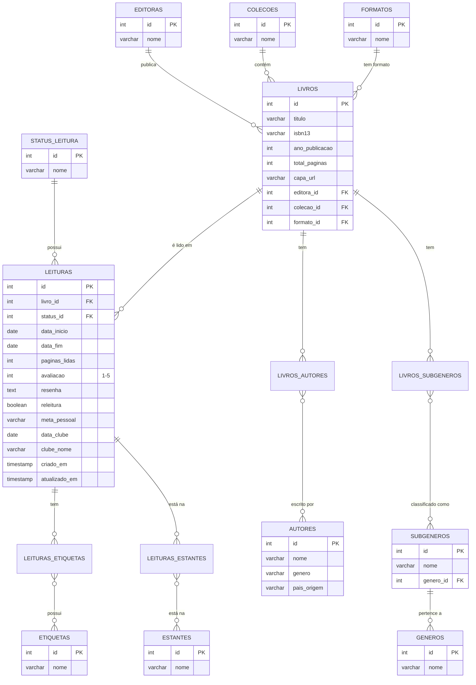

# BookTrack API – Seu Skoob Pessoal com Análises Literárias

## Descrição

**BookTrack API** é uma aplicação backend desenvolvida em **FastAPI** para o gerenciamento e análise de uma biblioteca pessoal.  
O sistema permite cadastrar livros, acompanhar o progresso de leitura, importar coleções via **CSV** e gerar análises literárias por gênero, autor e status de leitura.  

Além de servir como ferramenta pessoal, o projeto oferece uma **view pública limitada**, possibilitando que terceiros explorem parte do acervo de forma segura.

A modelagem segue o padrão **Star Schema**, integrando conceitos de **engenharia de dados** e **boas práticas de APIs REST**.  
Este projeto foi idealizado como um estudo prático de **POO em Python**, **FastAPI**, **modelagem de dados** e **deploy em nuvem**.

## Diagrama ER – Modelo Estrela
