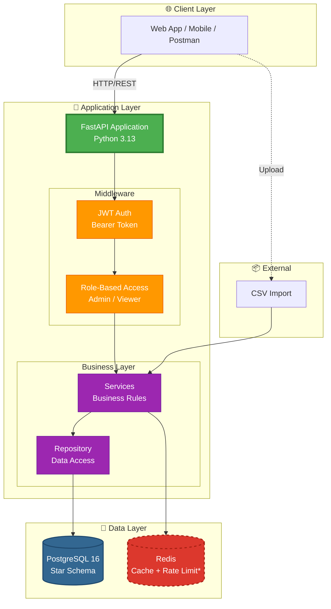
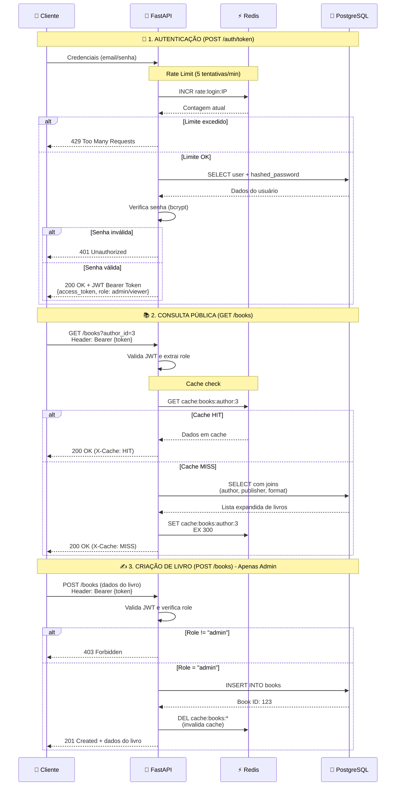
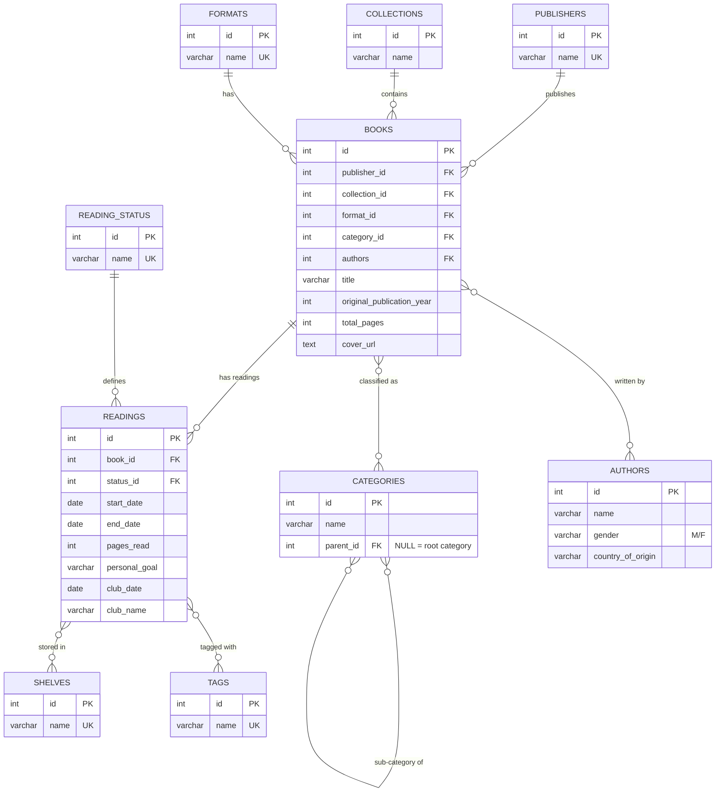

# BookTrack API – Gerenciamento de Livros com FastAPI 

[](https://www.python.org/)
[](https://www.postgresql.org/)
[](https://www.docker.com/)

[](https://fastapi.tiangolo.com/)
[](https://alembic.sqlalchemy.org/en/latest/)
[](https://www.sqlalchemy.org/)


## Descrição

**BookTrack API** é uma aplicação backend desenvolvida em **FastAPI** para o gerenciamento e análise de uma biblioteca pessoal. O sistema permite cadastrar livros, acompanhar o progresso de leitura, importar coleções via **CSV** e gerar análises literárias por gênero, autor e status de leitura.  

Além de servir como ferramenta pessoal, o projeto oferece uma **view pública limitada**, possibilitando que terceiros explorem parte do acervo de forma segura.

A modelagem segue o padrão **Star Schema**, integrando conceitos de **engenharia de dados** e **boas práticas de APIs REST**. Este projeto foi idealizado como um estudo prático de **POO em Python**, **FastAPI**, **modelagem de dados** e **deploy em nuvem**.

---

## 🏗️ Arquitetura da API


```mermaid
graph TB
    subgraph "🌐 Client Layer"
        Client[Web App / Mobile / Postman]
    end

    subgraph "🚀 Application Layer"
        direction TB
        API[FastAPI Application<br/>Python 3.13]
        
        subgraph "Middleware"
            Auth[JWT Auth<br/>Bearer Token]
            RBAC[Role-Based Access<br/>Admin / Viewer]
        end
        
        subgraph "Business Layer"
            Service[Services<br/>Business Rules]
            Repo[Repository<br/>Data Access]
        end
    end

    subgraph "💾 Data Layer"
        direction LR
        PostgreSQL[(PostgreSQL 16<br/>Star Schema)]
        Redis[(Redis<br/>Cache + Rate Limit*)]
    end

    subgraph "📦 External"
        CSV[CSV Import]
    end

    %% Connections
    Client -->|HTTP/REST| API
    API --> Auth
    Auth --> RBAC
    RBAC --> Service
    Service --> Repo
    Repo --> PostgreSQL
    Service --> Redis
    Client -.->|Upload| CSV
    CSV --> Service

    %% Styles
    style API fill:#4CAF50,stroke:#2E7D32,stroke-width:3px,color:#fff
    style PostgreSQL fill:#336791,stroke:#1F496E,stroke-width:2px,color:#fff
    style Redis fill:#DC382D,stroke:#A41E11,stroke-width:2px,color:#fff,stroke-dasharray: 5 5
    style Auth fill:#FF9800,stroke:#E65100,stroke-width:1px,color:#fff
    style RBAC fill:#FF9800,stroke:#E65100,stroke-width:1px,color:#fff
    style Service fill:#9C27B0,stroke:#6A1B9A,stroke-width:1px,color:#fff
    style Repo fill:#9C27B0,stroke:#6A1B9A,stroke-width:1px,color:#fff
```

> *Redis será implementado futuramente para rate limiting e cache*

---

## 🔄 Fluxo da API


```mermaid
sequenceDiagram
    participant User as 📱 Cliente
    participant API as 🚀 FastAPI
    participant Redis as ⚡ Redis
    participant DB as 🐘 PostgreSQL

    Note over User,DB: 🔐 1. AUTENTICAÇÃO (POST /auth/token)
    User->>API: Credenciais (email/senha)
    
    Note over API,Redis: Rate Limit (5 tentativas/min)
    API->>Redis: INCR rate:login:IP
    Redis-->>API: Contagem atual
    
    alt Limite excedido
        API-->>User: 429 Too Many Requests
    else Limite OK
        API->>DB: SELECT user + hashed_password
        DB-->>API: Dados do usuário
        API->>API: Verifica senha (bcrypt)
        
        alt Senha inválida
            API-->>User: 401 Unauthorized
        else Senha válida
            API-->>User: 200 OK + JWT Bearer Token<br/>{access_token, role: admin/viewer}
        end
    end

    Note over User,DB: 📚 2. CONSULTA PÚBLICA (GET /books)
    User->>API: GET /books?author_id=3<br/>Header: Bearer {token}
    
    API->>API: Valida JWT e extrai role
    
    Note over API,Redis: Cache check
    API->>Redis: GET cache:books:author:3
    
    alt Cache HIT
        Redis-->>API: Dados em cache
        API-->>User: 200 OK (X-Cache: HIT)
    else Cache MISS
        API->>DB: SELECT com joins<br/>(author, publisher, format)
        DB-->>API: Lista expandida de livros
        API->>Redis: SET cache:books:author:3<br/>EX 300
        API-->>User: 200 OK (X-Cache: MISS)
    end

    Note over User,DB: ✍️ 3. CRIAÇÃO DE LIVRO (POST /books) - Apenas Admin
    User->>API: POST /books (dados do livro)<br/>Header: Bearer {token}
    
    API->>API: Valida JWT e verifica role
    
    alt Role != "admin"
        API-->>User: 403 Forbidden
    else Role = "admin"
        API->>DB: INSERT INTO books
        DB-->>API: Book ID: 123
        API->>Redis: DEL cache:books:*<br/>(invalida cache)
        API-->>User: 201 Created + dados do livro
    end
```

---

## 🗂 **Estrutura do Projeto**

```
booktrack_api/
  ├── booktrack_fastapi/
  │   ├── core/              # Configurações gerais
  │   ├── models/            # Modelos SQLAlchemy
  │   ├── schemas/           # Schemas Pydantic
  │   ├── repositories/      # Acesso ao banco
  │   ├── services/          # Regras de negócio
  │   ├── routers/           # Rotas da API
  │   ├── utils/             # Funções auxiliares
  │   └── main.py            # Ponto de entrada
  ├── data/                  # Dados de exemplo (CSV)
  ├── BACKLOG.MD             # Backlog do projeto
  ├── CLAUDE.MD              # Instruções para o Claude
  ├── docs/                  # Documentação
  ├── scripts/               # Scripts auxiliares
  ├── tests/                 # Testes
  ├── .dockerignore          # Arquivos ignorados pelo Docker
  ├── .env.docker.example    # Exemplo de variáveis de ambiente para Docker
  ├── .env.example           # Exemplo de variáveis de ambiente
  ├── .gitignore             # Arquivos ignorados pelo Git
  ├── docker-compose.yml     # Configuração do Docker
  ├── Dockerfile               # Configuração do Docker
  ├── alembic.ini            # Configuração do Alembic
  ├── pyproject.toml         # Configuração do Poetry
  ├── poetry.lock            # Dependências do Poetry
  ├── poetry.toml            # Configuração do Poetry
  ├── README.md              # README do projeto
``` 

---

## 📚 **Exemplos de Endpoints**

### 🔐 Autenticação

`POST /auth/token`

```json
{
  "username": "user@email.com",
  "password": "******"
}
```

**Resposta:**
```json
{
  "access_token": "eyJhbGciOiJIUzI1NiIs...",
  "token_type": "bearer"
}
```

---

### ➕ Criar um livro

`POST /books/`

```json
{
  "title": "1984",
  "original_publication_year": 1949,
  "total_pages": 328,
  "publisher_id": 1,
  "author_id": 3,
  "format_id": 1,
  "category_id": 6
}
```

---

### 🔍 Filtrar livros

`GET /books/?author_id=3&year=1949`

---

### 📘 Exemplo de retorno expandido

```json
{
  "id": 1,
  "title": "1984",
  "publisher": {
    "id": 1,
    "name": "Penguin Books"
  },
  "format": {
    "id": 1,
    "name": "Físico"
  },
  "author": {
    "id": 3,
    "name": "George Orwell"
  }
}
```

---

## 📊 Diagrama ER – Modelo Estrela


```mermaid
erDiagram
    %% ========== 1. BASIC DIMENSIONS ==========
    AUTHORS {
        int id PK
        varchar name
        varchar gender "M/F"
        varchar country_of_origin
    }

    PUBLISHERS {
        int id PK
        varchar name UK
    }

    COLLECTIONS {
        int id PK
        varchar name
    }

    SHELVES {
        int id PK
        varchar name UK
    }

    FORMATS {
        int id PK
        varchar name UK
    }

    READING_STATUS {
        int id PK
        varchar name UK
    }

    TAGS {
        int id PK
        varchar name UK
    }

    %% ========== 2. HIERARCHICAL CATEGORIES ==========
    CATEGORIES {
        int id PK
        varchar name
        int parent_id FK "NULL = root category"
    }

    %% ========== 3. BOOKS ==========
    BOOKS {
        int id PK
        int publisher_id FK
        int collection_id FK
        int format_id FK
        int category_id FK 
        int authors FK
        varchar title
        int original_publication_year
        int total_pages
        text cover_url
        
    }

    %% ========== 5. READINGS ==========
    READINGS {
        int id PK
        int book_id FK
        int status_id FK
        date start_date
        date end_date
        int pages_read
        varchar personal_goal
        date club_date
        varchar club_name
    }

    %% ========== RELATIONSHIPS ==========
    PUBLISHERS ||--o{ BOOKS : "publishes"
    COLLECTIONS ||--o{ BOOKS : "contains"
    FORMATS ||--o{ BOOKS : "has"
    BOOKS }o--o{ AUTHORS : "written by"
    BOOKS }o--o{ CATEGORIES : "classified as"
    CATEGORIES }o--o{ CATEGORIES : "sub-category of"
    BOOKS ||--o{ READINGS : "has readings"
    READING_STATUS ||--o{ READINGS : "defines"
    READINGS }o--o{ TAGS : "tagged with"
    READINGS }o--o{ SHELVES : "stored in"
```

---

## 📖 Documentação Adicional

- [Fluxo completo de autenticação](docs/auth-flow.md)
- [Cache com Redis (futuro)](docs/caching-strategy.md)
- [Importação CSV](docs/csv-import.md)
- [Swagger UI](https://seu-projeto.onrender.com/docs) *(disponível após deploy)*

---

## 🚀 Como Executar

```bash
# Clone o repositório
git clone https://github.com/seu-usuario/booktrack-api.git

# Crie um ambiente virtual
python -m venv venv
source venv/bin/activate  # Linux/Mac
venv\Scripts\activate     # Windows

# Instale as dependências
pip install -r requirements.txt

# Configure as variáveis de ambiente
cp .env.example .env

# Execute as migrações
alembic upgrade head

# Inicie o servidor
uvicorn booktrack_fastapi.main:app --reload
```

---

## 🛠️ Tecnologias Utilizadas

| Tecnologia | Versão | Propósito |
|:---|:---:|:---|
| Python | 3.13 | Linguagem principal |
| FastAPI | 0.121.0 | Framework web |
| PostgreSQL | 16 | Banco de dados relacional |
| SQLAlchemy | 2.0.44 | ORM |
| Alembic | 1.17.1 | Migrações |
| Docker | 3.9 | Containerização |

---

## 📄 Licença

Este projeto está sob a licença MIT. Consulte o arquivo [LICENSE](LICENSE) para mais informações.

---

## 👨‍💻 Autor

Desenvolvido como projeto de portfólio para estudo de **FastAPI**, **engenharia de dados** e **boas práticas de backend**.

---

*Em desenvolvimento ativo 🚀*


