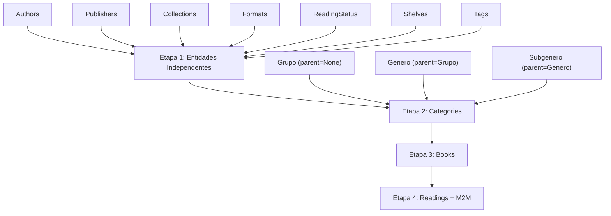

# BT-012 — Mapeamento CSV → Models

## Passo 1 — Análise do CSV

| Item | Valor |
|---|---|
| **Arquivo** | `data/minha-biblioteca-leituras.csv` |
| **Encoding** | UTF-8 |
| **Linhas de dados** | 525 (526 total, 1 vazia no final) |

### Cabeçalho (21 colunas úteis + 14 colunas vazias extras)

```
Name, Colecao, Estante, Grupo, Genero, Subgenero, AnoPublicacao, Origem,
Escritor, GeneroEscritor, Editora, Etiqueta, Formato, Status, Meta,
ClubeLivro, DataClube, TotalPagina, Capa, DataInicio, DataFim
```

### Primeiras 5 linhas de dados

| Name | Colecao | Estante | Grupo | Genero | Subgenero | AnoPublicacao | Origem | Escritor | GeneroEscritor | Editora | Etiqueta | Formato | Status | Meta | ClubeLivro | DataClube | TotalPagina | Capa | DataInicio | DataFim |
|---|---|---|---|---|---|---|---|---|---|---|---|---|---|---|---|---|---|---|---|---|
| Os abismos | | Livro | Ficção | Romance | | 2022 | Colômbia | Pilar Quintana | Feminino | Intrínseca | Tenho | EPUB | Em Análise | | Verba Aeterna | 10/2025 | 272 | https://... | | |
| A Origem das Espécies | | Livro | Não Ficção | Biologia | | | | Charles Darwin | Masculino | Edipro | Não Tenho | - | Quero Ler | | | | | | | |
| A Viagem de Beagle | | Livro | Não Ficção | Biologia | | | | Charles Darwin | Masculino | Edipro | Tenho | Físico | Fila | | | | | | | |
| A expressão das emoções... | | Livro | Não Ficção | Biologia | | | | Charles Darwin | Masculino | Cia das Letras | Não Tenho | - | Quero Ler | | | | | | | |
| Filhos Da Esperança | | Livro | Ficção | Científica | Distopia | 1992 | Reino Unido | P. D. James | Masculino | Aleph | Desejado | - | Quero Ler | | Babliotecas | 07/2024 | 368 | https://... | | |

### Colunas com valores vazios frequentes

| Coluna | Vazios | "-" como placeholder | Observação |
|---|---|---|---|
| Colecao | 307 (58%) | 0 | Maioria dos livros não pertence a coleção |
| Meta | 512 (97%) | 0 | Apenas 14 registros, valores: "2024", "2025" |
| ClubeLivro | 457 (87%) | 0 | 7 clubes: Verba Aeterna, Ler Juntos, etc. |
| DataClube | 492 (94%) | 0 | Formato MM/YYYY |
| DataInicio | 468 (89%) | 30 | Formato DD/MM/YYYY |
| DataFim | 471 (90%) | 22 | Formato DD/MM/YYYY |
| Formato | 1 | **418 (80%)** | `-` é o valor dominante |
| Subgenero | 44 | 0 | Nem todo gênero tem subgênero |
| AnoPublicacao | 28 | 4 | `-` aparece 4x |
| TotalPagina | 25 | 9 | `-` aparece 9x |
| Capa | 22 | 17 | `-` aparece 17x |
| Escritor | 18 | 0 | Coletâneas/antologias sem autor |
| Editora | 16 | 8 | `-` aparece 8x |
| Origem | 26 | 0 | País do autor |
| Status | 0 | **2** | Apenas 2 livros: "Sistemas de BD" e "Econometria Básica" |

### Formatos de data

| Coluna | Formato | Exemplos |
|---|---|---|
| DataClube | `MM/YYYY` | 10/2025, 07/2024, 05/2025 |
| DataInicio | `DD/MM/YYYY` | 15/08/2023, 09/09/2025, 07/04/2025 |
| DataFim | `DD/MM/YYYY` | 19/09/2022, 31/08/2025, 06/04/2025 |

### Valores únicos por coluna-chave

| Coluna | Valores |
|---|---|
| Estante | Livro, Revista |
| Grupo | Ficção, Não Ficção |
| Genero | 21 valores (Aventura, Biografia, Biologia, Científica, Drama, etc.) |
| Subgenero | 116 valores (Alta Fantasia, Apocalíptico, Clássico, Distopia, etc.) |
| Etiqueta | Desejado, **Em Análise / Em análise** ⚠️, Emprestado, Não Tenho, Tenho |
| Formato | -, Audio, EPUB, Físico |
| Status | -, Abandonado, **Em Análise / Em análise** ⚠️, Fila, Lendo, Lido, Pausado, Quero Ler |
| GeneroEscritor | Feminino, Masculino |
| ClubeLivro | Babliotecas, Clube de Literatura Clássica, Ler Juntos, Mulheres em Dados, Pepa Silveira, Páginas Elétricas, Verba Aeterna |
| Meta | 2024, 2025 |
| Origem | 31 países |

> [!WARNING]
> **Inconsistências de case detectadas:**
> - Status: "Em Análise" vs "Em análise" → normalizar para "Em Análise"
> - Etiqueta: "Em Análise" vs "Em análise" → normalizar para "Em Análise"
> - Autor: "Jeff Vandermeer" vs "Jeff VanderMeer" → normalizar para "Jeff VanderMeer"

---

## Passo 2 — Models do Banco

### Books (`books`)

| Campo | Tipo | Obrigatório | FK |
|---|---|---|---|
| id | int (PK) | auto | |
| title | String(255) | **Sim** | |
| original_publication_year | int | Não | |
| total_pages | int | Não | |
| cover_url | Text | Não | |
| publisher_id | int | Não | → publishers.id |
| collection_id | int | Não | → collections.id |
| format_id | int | Não | → formats.id |
| category_id | int | Não | → categories.id |
| author_id | int | Não | → authors.id |

**Relacionamentos M2M:** `books_authors`, `books_categories`
**Relacionamentos 1:N:** `readings`

> [!IMPORTANT]
> Books tem **dois** caminhos para Author: FK singular `author_id` e M2M `books_authors`.
> Idem para Category: FK singular `category_id` e M2M `books_categories`.
> O CSV tem um único autor por livro → usar `author_id` (FK singular).
> A hierarquia de categorias (Grupo/Genero/Subgenero) será vinculada via `category_id` apontando para a categoria mais específica disponível.

### Authors (`authors`)

| Campo | Tipo | Obrigatório |
|---|---|---|
| id | int (PK) | auto |
| name | String(255) | **Sim** |
| gender | String(1) | Não |
| country_of_origin | String(255) | Não |

> [!WARNING]
> O CSV tem `GeneroEscritor` com "Feminino"/"Masculino", mas o model usa `String(1)`.
> **Mapeamento necessário:** Feminino → "F", Masculino → "M"

### Readings (`readings`)

| Campo | Tipo | Obrigatório | FK |
|---|---|---|---|
| id | int (PK) | auto | |
| book_id | int | **Sim** | → books.id |
| status_id | int | **Sim** | → reading_status.id |
| updated_at | DateTime | auto (server_default) | |
| start_date | Date | Não | |
| end_date | Date | Não | |
| pages_read | int | Não | |
| personal_goal | String(255) | Não | |
| club_date | Date | Não | |
| club_name | String(255) | Não | |

**Relacionamentos M2M:** `readings_tags`, `readings_shelves`

### Categories (`categories`)

| Campo | Tipo | Obrigatório | FK |
|---|---|---|---|
| id | int (PK) | auto | |
| name | String(255) | **Sim** | |
| parent_id | int | Não | → categories.id (self-ref) |

**Hierarquia:** parent → children (self-referencial)

### Entidades simples (id + name)

| Model | Tabela | unique no name |
|---|---|---|
| Publishers | `publishers` | **Sim** |
| Collections | `collections` | Não |
| Formats | `formats` | **Sim** |
| Shelves | `shelves` | **Sim** |
| Tags | `tags` | **Sim** |
| ReadingStatus | `reading_status` | **Sim** |

### Tabelas de associação (M2M)

| Tabela | FK 1 | FK 2 |
|---|---|---|
| `books_authors` | book_id → books.id | author_id → authors.id |
| `books_categories` | book_id → books.id | category_id → categories.id |
| `readings_tags` | reading_id → readings.id | tag_id → tags.id |
| `readings_shelves` | reading_id → readings.id | shelf_id → shelves.id |

---

## Passo 3 — Mapeamento Completo

| Coluna CSV | Model | Campo | Obrigatório? | Observação |
|---|---|---|---|---|
| Name | Books | `title` | **Sim** | String(255). 1 linha vazia no final (ignorar) |
| Colecao | Collections | `name` | Não | 307 vazios. Criar entidade e vincular via `Books.collection_id` |
| Estante | Shelves | `name` | Não | Via M2M `readings_shelves`. Valores: "Livro", "Revista" |
| Grupo | Categories | `name` | Não | Nível raiz (`parent_id=None`). Valores: "Ficção", "Não Ficção" |
| Genero | Categories | `name` | Não | Filho de Grupo (`parent_id=grupo.id`) |
| Subgenero | Categories | `name` | Não | Filho de Genero (`parent_id=genero.id`). 116 valores únicos |
| AnoPublicacao | Books | `original_publication_year` | Não | int. "-" e vazio → None |
| Origem | Authors | `country_of_origin` | Não | 31 países. Pertence ao autor, não ao livro |
| Escritor | Authors | `name` | Não | 18 vazios. ⚠️ "Jeff Vandermeer"/"Jeff VanderMeer" |
| GeneroEscritor | Authors | `gender` | Não | Mapear: "Feminino"→"F", "Masculino"→"M" |
| Editora | Publishers | `name` | Não | "-" e vazio → None (não criar publisher) |
| Etiqueta | Tags | `name` | Não | Via M2M `readings_tags`. Normalizar "Em análise"→"Em Análise" |
| Formato | Formats | `name` | Não | "-" (418x) e vazio → None. Formatos reais: Audio, EPUB, Físico |
| Status | ReadingStatus | `name` | **Sim** | "-" (2x) → tratamento especial (ver decisão 1) |
| Meta | Readings | `personal_goal` | Não | Valores: "2024", "2025". 512 vazios |
| ClubeLivro | Readings | `club_name` | Não | 7 clubes. 457 vazios |
| DataClube | Readings | `club_date` | Não | Formato MM/YYYY → converter para `date(YYYY, MM, 1)` |
| TotalPagina | Books | `total_pages` | Não | int. "-" e vazio → None |
| Capa | Books | `cover_url` | Não | URL completa. "-" e vazio → None |
| DataInicio | Readings | `start_date` | Não | DD/MM/YYYY → `date`. "-" → None |
| DataFim | Readings | `end_date` | Não | DD/MM/YYYY → `date`. "-" → None |

> [!NOTE]
> **Coluna `Origem` (país):** Não existe campo no model `Books`. Pertence ao **Authors** como `country_of_origin`. Será preenchido durante a criação/atualização do autor.

> [!NOTE]
> **Campo `pages_read` do model Readings:** Não existe coluna correspondente no CSV. Será mantido como `None`.

---

## Passo 4 — Decisões Necessárias

### Decisão 1 — Livros com Status "-" (2 ocorrências)

Os livros "Sistemas de Banco de Dados" e "Econometria Básica" têm `Status = "-"`.

**Recomendação:** Criar o livro normalmente e criar a leitura com um status padrão. Sugiro normalizar o `-` para **"Quero Ler"** (o status mais neutro/genérico), pois `status_id` é obrigatório no model Readings. Alternativa: criar um status "Indefinido".

**Aguardando decisão da autora.**

### Decisão 2 — Livros com Formato "-" (418 ocorrências)

80% dos livros têm `Formato = "-"`. Isso representa a maioria dos registros.

**Recomendação:** Tratar `-` como `None` → `Books.format_id = None`. Não criar um formato "Desconhecido" pois poluiria a tabela. Os 3 formatos reais são: Audio, EPUB, Físico.

### Decisão 3 — Hierarquia de Categories

O model `Categories` possui `parent_id` self-referencial. ✅ Confirmado.

A hierarquia seria:
```
Ficção (parent_id=None)
├── Romance (parent_id=ficção.id)
│   ├── Clássico (parent_id=romance.id)
│   └── Contemporâneo (parent_id=romance.id)
└── Científica (parent_id=ficção.id)
    └── Distopia (parent_id=científica.id)
```

**Livro com Grupo mas sem Genero/Subgenero:** `Books.category_id` aponta para a categoria mais específica disponível. Se só tem Grupo, aponta para o Grupo. Se tem Grupo+Genero, aponta para Genero. Se tem os 3, aponta para Subgenero.

**Livro sem Grupo:** `Books.category_id = None`.

### Decisão 4 — Authors duplicados

O `get_or_create` deve deduplicar por nome **exato** (case-sensitive). Porém, detectei 1 variação:
- "Jeff Vandermeer" vs "Jeff VanderMeer"

**Recomendação:** Normalizar no script antes do `get_or_create` usando um mapa de correções manual:
```python
AUTHOR_CORRECTIONS = {
    'Jeff Vandermeer': 'Jeff VanderMeer',
}
```

Não usar `.lower()` generalizado porque há nomes legítimos com capitalização específica (ex: "P. D. James").

### Decisão 5 — Idempotência

O padrão `get_or_create` garante que entidades simples (Authors, Publishers, etc.) não serão duplicadas se executado mais de uma vez, **desde que** a busca seja feita pelo mesmo critério (ex: `name` exato).

Para as associações M2M (`readings_tags`, `readings_shelves`), é necessário verificar se a associação já existe antes de inserir. Com SQLAlchemy, ao recarregar a reading existente e verificar se a tag/shelf já está na lista, evitamos duplicação.

**Ponto de atenção:** O maior risco de duplicação está na tabela `Readings`. Se o script for executado 2x, a mesma reading (book_id + status_id) seria inserida novamente. Para garantir idempotência, o script deve verificar se já existe uma reading para o `book_id` antes de criar.

---

## Ordem de Importação (Dependências)



**Etapa 1:** Authors, Publishers, Collections, Formats, ReadingStatus, Shelves, Tags
**Etapa 2:** Categories (Grupo → Genero → Subgenero)
**Etapa 3:** Books (vinculando FKs para author, publisher, collection, format, category)
**Etapa 4:** Readings (vinculando book_id + status_id) + M2M (readings_tags, readings_shelves)
