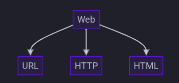
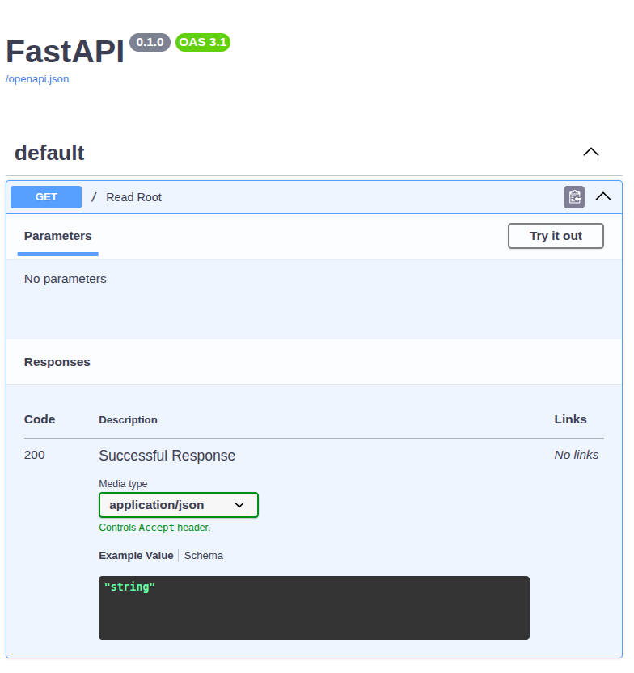

# FastAPI do Zero

## Aula 2 - Introdução ao Desenvolvimento Web

### A WEB

O FastAPI é um framework para desenvolvimento de aplicações web, ou seja, uma aplicação que funciona em rede, seja ela privada, doméstica, empresarial ou a internet. Em uma aplicação web, a comunicação em rede bidirecional denominada modelo cliente-servidor.

### Modelo Padrão Web

#### URL

#### HTTP

* Mensagens
* Mensagens de Resposta
* Cabeçalho
* Corpo
* Verbos
    * GET
    * POST
    * PUT
    * DELETE
* Códigos de Resposta
    * 1xx: Informativo
    * 2xx: Sucesso
    * 3xx: Redirecionamento
    * 4xx: Erro no Cliente
    * 5xx: Erro no Servidor

#### HTML

Recomenda-se o uso de templates

* [Jinja](https://jinja.palletsprojects.com/en/stable/)

### APIs

#### Endpoint

Endereço na web (URL) onde o servidor ou a API está ativo e pronto para responder a requisições dos clientes

#### Documentação

* [OpenAPI](https://swagger.io/specification/)
* [Swagger](https://swagger.io/tools/swagger-ui/)

* [Redoc](https://redocly.github.io/redoc/)

### Aprofundamento nos estudos

* [WebSockets - Live de Python #164](https://www.youtube.com/watch?v=EqFzY8dBWHs&t=2s)
* [Documentando APIs com OpenAPI - Live de Python #178](https://www.youtube.com/watch?v=TfGHNBaK9a0)
